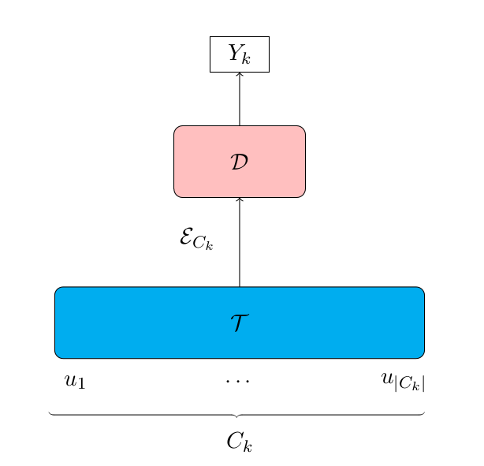

<h1 align="center">
    Intents Classification for Neural Text Generation 
    <br/>
</h1>

<p align="center">
    The project consists of building an intent classifier which purpose is to pedict the sequence of labels  in a dialogue 
    <br/> 
</p>

<p align="center">
    
</p>

<p align="center">
     
     
    <a href="https://www.python.org/downloads/release/python-3100/" target="_blank">
        
    </a>
</p>

<p align="center">
    <a href="https://fr.overleaf.com/6151584112drdsyxchsryy">
         
    </a>
</p>


Abstract :

>*The hype around OpenAI's ChatGPT has more than ever sparked interest in AI-based bots where labeling and classification of utterances are a centerpiece in order to improve user experience. Broadly, Dialogue Acts (DA) and Emotion/Sentiment (E/S) tasks are identified through sequence labeling systems that are trained in a supervised manner. In this work, we propose four encoder-decoder models to learn generic representations adapted to the spoken dialog, which we evaluate on six datasets of different sizes of the Sequence labellIng Evaluation benChmark fOr spoken laNguagE benchmark (SILICONE) benchmark. Designed models are represented with either a hierarchical encoder or non-hierarchical encoders both based on pre-trained transformers (BERT/XLNet). We notice the failure of the models to learn some datasets due to their inherent properties but in general, the BERT-GRU architecture is the best model regarding accuracy.*

## Getting Started

1. Clone the repository
```bash
git clone https://github.com/konkinit/intent_classification.git
```

2. Upgrade `pip` and install the dependencies
```bash
python -m pip install --upgrade pip
pip install -r requirements.txt --user
```

3. Run the script `./src/utils/get_datasets.py` until all the experiment datasets of [SILICONE](https://huggingface.co/datasets/silicone)
   are downloaded

4. Run the notebook `./notebooks/experimental_results.ipynb`


## Architecture of used models

We design 4 models based on the below encoder-decoder architecture where $\mathcal{T}$ and $\mathcal{D}$ are 
respectively an encoder and a decoder. Typically an encoder is a transformer in our case a BERT or XLNet model 
and a decoder a neural network which can be a plain MLP or a GRU.





## Experimental results

The models we dsigned have been applied to some datasets of [SILICONE](https://huggingface.co/datasets/silicone)
to obtain the following results:

|  Architecture  | $\mathtt{SWdA}$ | $\mathtt{DyDA_a}$ | $\mathtt{MRDA}$ | $\mathtt{DyDA_e}$ | $\mathtt{MELD_e}$ | $\mathtt{MELD_s}$ |
|:--------------:|:---------------:|:-----------------:|:---------------:|:---------------:|:---------------:|:----------------:|
| BERT + MLP   | 37.4 | 63.5 | 69.1 | 86.1 | 52.0 | 57.8 |
| BERT + GRU   | 44.0 | 81.9 | 69.3 | 86.7 | 60.5 | 70.3 |
| XLNet + MLP  | 39.1 | 61.7 | 69.3 | 85.7 | 52.3 | 53.7 |
| XLNet + GRU  | 58.7 | 78.3 | 69.3 | 85.3 | 51.2 | 63.9 |
